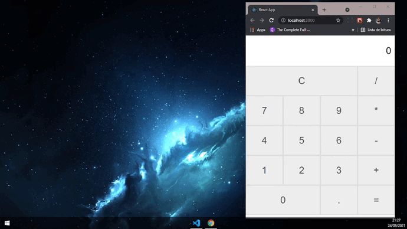

# Calculator in React

This project was created through the learning acquired in the course [The Complete Full-Stack JavaScript Course](https://www.udemy.com/course/full-stack-javascript/)

Esse projeto foi criado através do aprendizado adquirido no curso [The Complete Full-Stack JavaScript Course](https://www.udemy.com/course/full-stack-javascript/)
## Available Scripts

In the project directory, you can run:
No diretório do projeto, você pode executar:

### `npm start`

Runs the app in the development mode.\
Open [http://localhost:3000](http://localhost:3000) to view it in the browser.

The page will reload if you make edits.\
You will also see any lint errors in the console.

Executa o aplicativo no modo de desenvolvimento. \
Abra [http: // localhost: 3000] (http: // localhost: 3000) para visualizá-lo no navegador.

A página será recarregada se você fizer edições. \
Você também verá quaisquer erros de lint no console.

### `npm run build`

Builds the app for production to the `build` folder.\
It correctly bundles React in production mode and optimizes the build for the best performance.

The build is minified and the filenames include the hashes.\
Your app is ready to be deployed!

See the section about [deployment](https://facebook.github.io/create-react-app/docs/deployment) for more information.

Compila o aplicativo para produção na pasta `build`. \
Ele agrupa corretamente o React no modo de produção e otimiza a construção para o melhor desempenho.

A compilação é reduzida e os nomes dos arquivos incluem os hashes. \
Seu aplicativo está pronto para ser implantado!

Consulte a seção sobre [implantação](https://facebook.github.io/create-react-app/docs/deployment) para obter mais informações.
## Learn More

You can learn more in the [Create React App documentation](https://facebook.github.io/create-react-app/docs/getting-started).

To learn React, check out the [React documentation](https://reactjs.org/).

Você pode saber mais na [Documentação para criar uma aplicação React](https://facebook.github.io/create-react-app/docs/getting-started).

Para aprender o React, verifique a [Documentação do React](https://reactjs.org/).

# The Project
 